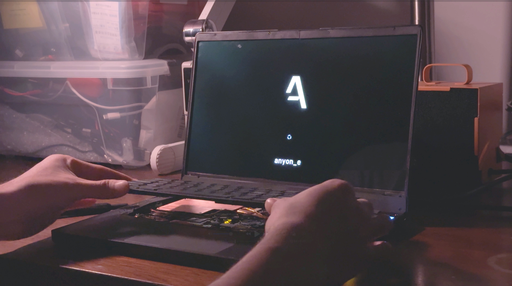

# anyon e

*also stylized as anyon_e*

A highly integrated, high end, open source laptop.

Mission: to disprove the idea that technology is either repairable and open or integrated and closed.

#

#### Features:

- RK3588 SoC Motherboard
  - CM3588-based
  - USB-C USB3.1 Gen 1
  - ESP32-S3 embedded controller
- Powertrain
  - ESP32-S3 embedded controller
  - ~60Wh Li-ion battery pack
- Peripherals
  - Wireless mechanical keyboard
  - Glass-topped multi-touch trackpad
- 4K AMOLED 13.3" display
- Anodized aluminum CNC chassis

#

#### YouTube Video:

#

*[ **an**-yon ]*

*exotic particles whose quantum statistics are neither bosonic nor fermionic.*[^1]

Integrated like bosons, distinct like fermions.

#

Thank you to the Phillips Exeter Academy Science Department for supporting this project.
*Non Sibi. Knowledge and Goodness. Youth From Every Quarter.* [^2]

[^1]: H. Bartolomei et al. ,Fractional statistics in anyon collisions.Science368,173-177(2020).DOI:10.1126/science.aaz5601

[^2]: Byran Huang's ('25) 2024-25 Fall Term Senior Project. Thank you to my advisors, Mr. Brad Robinson and Mr. Charles Mamolo.
